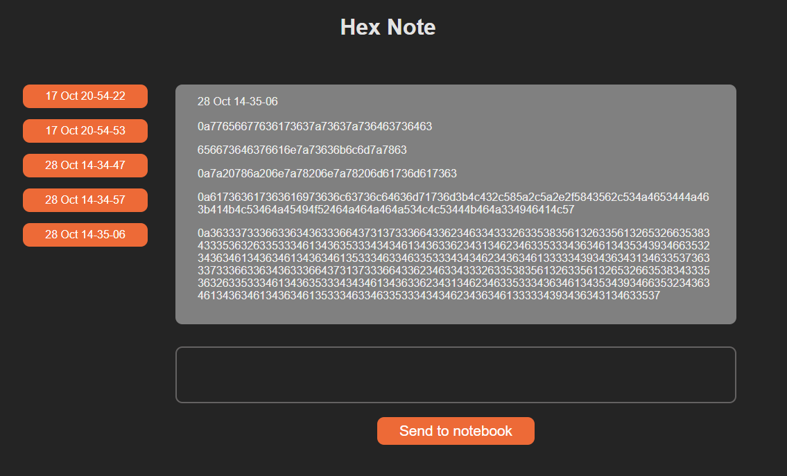

# HexNote: Full-Stack Note Encryption App



HexNote is a full-stack web application that allows you to create and save notes with text encoded in hexadecimal format. These notes can be saved as text files in a data folder.

## Table of Contents

- [Installation](#installation)
- [Usage](#usage)
- [Features](#features)
- [Folder Structure](#folder-structure)
- [Technologies Used](#technologies-used)
- [Authors](#authors)

## Installation

To run HexNote on your local machine, follow these steps:

1. Clone the repository:

   ```shell
   git clone https://github.com/RD2P/HexNote.git
   ```

2. Navigate to the project directory

   ```shell
   cd HexNote
   ```

3. Navigate to the client directory and install client dependencies

    ```shell
    cd client
    npm install
    ```

4. Navigate to the server directory and install the server dependencies

    ```shell
    cd ..
    cd server
    npm install
    ```

## Usage

To start the app, follow these steps:

1. In the server/ directory, start the server:

    ```shell
    npm start
    ```

2. In a separate terminal, cd into client/ and start the React app:

    ```shell
    cd client
    npm start
    ```

3. Open the React client on your web browser.

## Features

- Start writing notes in the text area
- The hexer function encodes each line (after each press of the "enter" key) to hexadecimal as you type
- After each note, click "Send to notebook"
- The note is saved in the data folder and is rendered on the left sidebar, titled with the date and time that it was made

## Folder Structure

    HexNote-Full-Stack/
      ├── client/               # React client-side code
      |    ├── js/
      |        ├── functions.js # stringToHex and hexToString code
      |    ├── src/
      |        ├── App.jsx
      |    ├── index.html       # Entry point for React app
      ├── server/               # Express server-side code
      |    ├── server.js        # Entry point for the server
      |    ├── data/            # Encoded notes are saved here

## Technologies Used

- Node.js
- Express.js
- React

## Author

- Raphael

Feel free to report issues and provide feedback!
